# WatchLog — Entity-Relationship Diagram

Reflects the EF Core model in `backend/src/WatchLog.Infrastructure/Persistence`. `users` is ASP.NET
Core Identity's table, extended with WatchLog's profile fields (see `ApplicationUser`).

```mermaid
erDiagram
    USERS ||--o{ REFRESH_TOKENS : has
    USERS ||--o{ DEVICES : registers
    USERS ||--o{ PASSKEY_CREDENTIALS : has
    USERS ||--o{ USER_LISTS : owns
    USERS ||--o{ EPISODE_PROGRESS : tracks
    USERS ||--o{ MOVIE_WATCHES : tracks
    USERS ||--o{ RATINGS : gives
    USERS ||--o{ COMMENTS : writes
    USERS ||--o{ LIKES : gives
    USERS ||--o{ FOLLOWS : follows
    USERS ||--o{ ACTIVITY_FEED_ENTRIES : generates
    USERS ||--o{ USER_ACHIEVEMENTS : earns
    USERS ||--o{ NOTIFICATIONS : receives
    USERS ||--o{ RECOMMENDATIONS : receives
    USERS ||--o{ AI_HISTORY_ENTRIES : asks
    USERS ||--o{ COLLECTIONS : creates

    SERIES ||--o{ SEASONS : has
    SEASONS ||--o{ EPISODES : has
    SERIES ||--o{ SERIES_GENRES : tagged
    MOVIES ||--o{ MOVIE_GENRES : tagged
    GENRES ||--o{ SERIES_GENRES : tags
    GENRES ||--o{ MOVIE_GENRES : tags

    USER_LISTS ||--o{ LIST_ITEMS : contains
    LIST_ITEMS }o--o| MOVIES : references
    LIST_ITEMS }o--o| SERIES : references

    EPISODES ||--o{ EPISODE_PROGRESS : "watched by"
    MOVIES ||--o{ MOVIE_WATCHES : "watched by"

    COLLECTIONS ||--o{ COLLECTION_ITEMS : contains
    COLLECTION_ITEMS }o--o| MOVIES : references
    COLLECTION_ITEMS }o--o| SERIES : references

    ACHIEVEMENTS ||--o{ USER_ACHIEVEMENTS : "awarded as"

    USERS {
        guid Id PK
        string Email
        string DisplayName
        string AvatarUrl
        string Bio
        string Locale
        int ThemePreference
        bool IsPrivate
        datetime CreatedAt
    }

    MOVIES {
        guid Id PK
        int TmdbId
        string Title
        date ReleaseDate
        int RuntimeMinutes
        double VoteAverage
    }

    SERIES {
        guid Id PK
        int TmdbId
        string Title
        date FirstAirDate
        int Status
        double VoteAverage
    }

    SEASONS {
        guid Id PK
        guid SeriesId FK
        int SeasonNumber
    }

    EPISODES {
        guid Id PK
        guid SeasonId FK
        int EpisodeNumber
        date AirDate
    }

    GENRES {
        guid Id PK
        int TmdbId
        string Name
    }

    USER_LISTS {
        guid Id PK
        guid UserId FK
        string Name
        int Type "Watching|Completed|Planned|OnHold|Dropped|Favorites|Custom"
        bool IsPublic
    }

    LIST_ITEMS {
        guid Id PK
        guid ListId FK
        guid MovieId FK "nullable"
        guid SeriesId FK "nullable"
    }

    EPISODE_PROGRESS {
        guid Id PK
        guid UserId FK
        guid EpisodeId FK
        int Status "Unwatched|Watched|Skipped"
        bool IsFavorite
        datetime WatchedAt
    }

    MOVIE_WATCHES {
        guid Id PK
        guid UserId FK
        guid MovieId FK
        bool IsWatched
        bool IsFavorite
    }

    RATINGS {
        guid Id PK
        guid UserId FK
        int TargetType
        guid TargetId
        int Score "1-10"
    }

    COMMENTS {
        guid Id PK
        guid UserId FK
        int TargetType
        guid TargetId
        guid ParentCommentId FK "nullable"
        string Body
    }

    LIKES {
        guid Id PK
        guid UserId FK
        int TargetType
        guid TargetId
    }

    FOLLOWS {
        guid Id PK
        guid FollowerId FK
        guid FollowingId FK
    }

    ACTIVITY_FEED_ENTRIES {
        guid Id PK
        guid UserId FK
        int Type
        string MetadataJson
    }

    ACHIEVEMENTS {
        guid Id PK
        string Code
        string Name
    }

    USER_ACHIEVEMENTS {
        guid Id PK
        guid UserId FK
        guid AchievementId FK
        datetime EarnedAt
    }

    NOTIFICATIONS {
        guid Id PK
        guid UserId FK
        int Type
        bool IsRead
    }

    RECOMMENDATIONS {
        guid Id PK
        guid UserId FK
        int TargetType
        guid TargetId
        double Score
        int Source "Algorithm|Ai|Curated"
    }

    AI_HISTORY_ENTRIES {
        guid Id PK
        guid UserId FK
        string Prompt
        string Response
    }

    DEVICES {
        guid Id PK
        guid UserId FK
        int Platform
        string PushToken
    }

    COLLECTIONS {
        guid Id PK
        string Name
        bool IsCurated
        guid CreatedByUserId FK "nullable"
    }

    COLLECTION_ITEMS {
        guid Id PK
        guid CollectionId FK
        guid MovieId FK "nullable"
        guid SeriesId FK "nullable"
    }

    REFRESH_TOKENS {
        guid Id PK
        guid UserId FK
        string TokenHash
        datetime ExpiresAt
    }

    PASSKEY_CREDENTIALS {
        guid Id PK
        guid UserId FK
        bytes CredentialId
        bytes PublicKey
        int SignCount
    }
```

